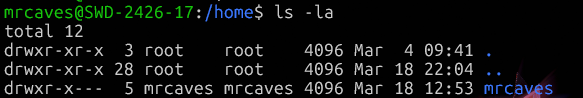
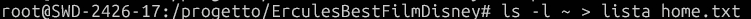
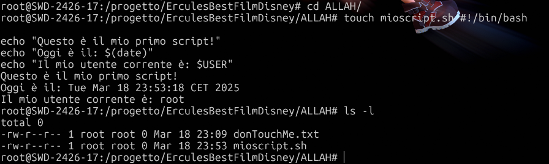

# Linux 101
## Passi Operativi
### 1. Identificazione della distribuzione e del sistema
- Il comando "cat /etc/os-release" viene usato per identificare la distribuzione e la versione (in questo caso la versione è la 24.04.2):

- Con "uname -r" verifichiamo la versione del kernel:

- Con "uname -a" mostriamo le informazioni generali del sistema:

### 2. Navigazione nel file system e gestione di file e directory

- Grazie al comand "cd" ci muoviamo nella home directory:

- Usando il comando "ls -la" verranno mostrati tutti i file nella home, compresi quelli nascosti:

- Il comando "mkdir -p progetto/esercizi/script" creerà una directory. Per fare ciò bisogna entrare nel root:

e poi successivamente eseguire il comando:

- Grazie al comando precedentemente usato ("cd") entriamo nella bellissima cartella creata:

- Con "touch nome.txt" creiamo un file di testo vuoto:

- Utilizzando "ls -l" verifichiamo se è stato effettivamente creato:

- "cp file.txt directory/" ci permette di copiare il file nella cartella che menzioniamo:

- Possiamo rinominare il file usando "mv nome-attuale.txt nome-nuovo.txt":

- Per eliminare il file bisogna usare "rm nome-file":

### 3. Uso del terminale, pipe e redirezioni

- Usando "ls -l ~ > lista_home.txt" Eseguiamo un comando che elenchi i contenuti della home per salvarli in un file chiamato "lista_home.txt":

- Facendo "cat lista_home.txt" verifichiamo che il file "lista_home.txt" sia stato creato correttamente, guardandone il contenuto:

- Per visualizzare tutti i processi attivi nel sistema, utilizza ps aux e accoppialo con grep per individuare una parola chiave specifica, come ad esempio "root":

- Se hai a disposizione un file di testo, ad esempio lista_home.txt, puoi cercare un determinato contenuto al suo interno, come la parola "Documents":

### 4. Installazione di un pacchetto open source e verifica licenza

- Aggiorna l’elenco dei pacchetti disponibili per l’installazione:

- Installa un determinato software, come tree:

- Controlla se il pacchetto è stato installato correttamente e verifica la versione attualmente in uso:

### 5. Creazione di uno script Bash di base

- Per creare uno script accedi alla cartella script (oppure una directory di tua scelta) e crea un nuovo file chiamato mioscript.sh:

- Modifica i permessi del file per poterlo eseguire come programma:

- Avvia lo script appena creato:

### 6. Archiviazione e compressione di file

- Crea un archivio compresso contenente la cartella script utilizzando tar:

- Comprimi ulteriormente l’archivio generato con gzip:

### 7. Verifica di processi e log di sistema

- Elenca tutti i processi in esecuzione nel sistema:

- Controlla i log di sistema (su Ubuntu il file si trova in /var/log/syslog, mentre in altre distribuzioni può essere in /var/log/messages o consultabile con journalctl):

## 8. Controllo della rete

- Visualizza le schede di rete presenti nel sistema:

- Esegui un test di connessione verso un sito remoto, come google.com:

 
## 9. Controllo dell’hardware e dei device files

- Mostra informazioni dettagliate sulla CPU in uso:

- Controlla lo stato della memoria RAM e il suo utilizzo attuale:

- Analizza la suddivisione dello spazio su disco:

- Verifica i dispositivi di archiviazione riconosciuti dal sistema:

